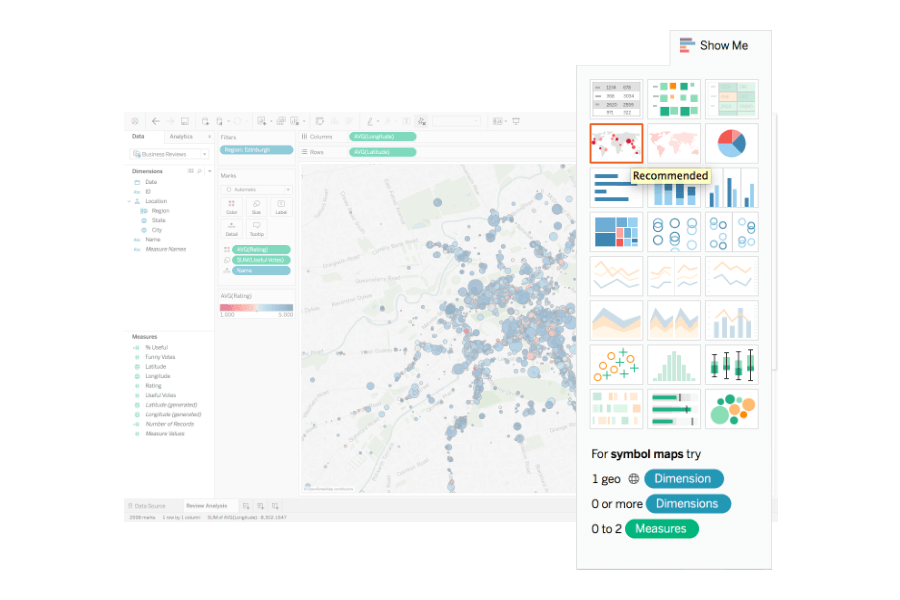

# bergfex_snowalert_part_II
Part II of this project focusses on the visualisation of webscraped data through tableau.

This repository showcases the visualization of data obtained and prepared in our Part I repository where we webscraped the Bergfex webpage (mountain sports information webpage) adding snow level information to each activity. It was elaborated by Malwina San José and Sarah Dutschke. 
We use TableauPublic for creating single plots, dashboards and stories.###### 
The information presented here is not approved for any kind of commercial use.

Project Team
-----------

[Sarah Dutschke](https://www.linkedin.com/in/sarah-dutschke/), 
[Malwina San José](https://www.linkedin.com/in/malwina-san-josé/),

Partners
 -------
[Bergex](https://www.bergfex.com/) is a company that provides a wide range of information about mountains (such as mountain activities, weather information, accommodation options etc.).

Project description
-------------------
Planning hikes in winter time can be complicated in Switzerland. Sometimes hiking in the snow is an exciting adventure, but it can also be an unexpected surprise. In part I of our project, we webscraped information of the different hikes (#### potentially add all sports) and added  information on current snow levels based on spatial data. 
In this project we focus on the visualization of such data with tableau, making the selection of the right #### hike more userfriendly.

Project Milestones
-------------------
### Milestone 1
Creating single charts of interests.

 ### Milestone 2
 Creating an interactive dashboard.

Outcomes
---------
As the final outcome of this project, we created a Tableau Public file (####link).

Example plots
---------

####add visualization of dashboard here

Requirements
------------
The libraries required to run this product are the following (details in environment.yml and environment2.yml):
  - ipykernel
  - pandas

XXX to update
  
  
Repository Structure
------------
